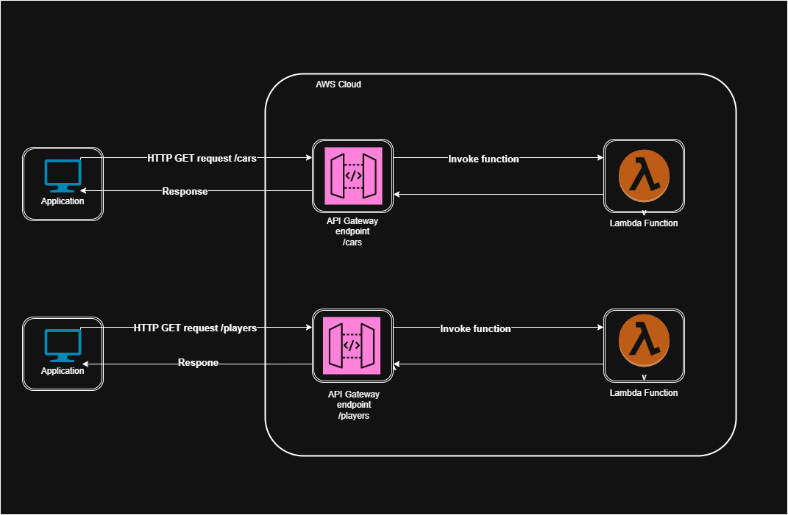

# AWS - Deploying RESTful APIs

This project is a hands-on practice to understand the following AWS concepts:

- The integration between Amazon API Gateway and AWS Lambda
- How API Gateway uses REST APIs
- API Gateway features and benefits
- Creating and deploying a REST API that integrates with Lambda

## AWS Lambda Functions

We have two AWS Lambda functions:

- `lambda_api_cars`
- `lambda_api_players`

### `lambda_api_cars`

Provides the following functionality:

- **GET /cars** – Retrieve a list of all cars
- **GET /cars/{id}** – Retrieve a specific car by its ID

### `lambda_api_players`

Provides the following functionality:

- **GET /players** – Retrieve a list of all players
- **GET /players/{id}** – Retrieve a specific player by their ID

## AWS API Gateway Setup

You will create two APIs in Amazon API Gateway: `api_cars` and `api_players`.

### Example: Setting up `api_cars`

1. Open API Gateway in the AWS Management Console.
2. Click **Create API**, choose **REST API**, and click **Build**.
3. Click **Create Resource** and set the resource name to `cars`.
4. With the `/cars` resource selected, click **Create Method** and choose `GET`.
5. Configure the method as follows:
   - **Integration type**: Lambda Function
   - **Lambda proxy integration**: Enabled
   - **Lambda function**: Select the region and choose `lambda_api_cars`
6. Click **Create Method**.

#### Adding Path Parameter `{id}`

1. Select the `/cars` resource.
2. Click **Create Resource**, and set the resource name to `{id}` (this will create `/cars/{id}`).
3. Create a `GET` method for this resource using the same steps as above.

You can now test your endpoints:

- Go to the **Test** tab.
- Try a `GET` request to `/cars`.
- Try a `GET` request to `/cars/{id}` with a sample ID.

### Setting up `api_players`

Follow the same steps used for `api_cars`, replacing the resource names and Lambda function with:

- Resource: `/players` and `/players/{id}`
- Lambda function: `lambda_api_players`
